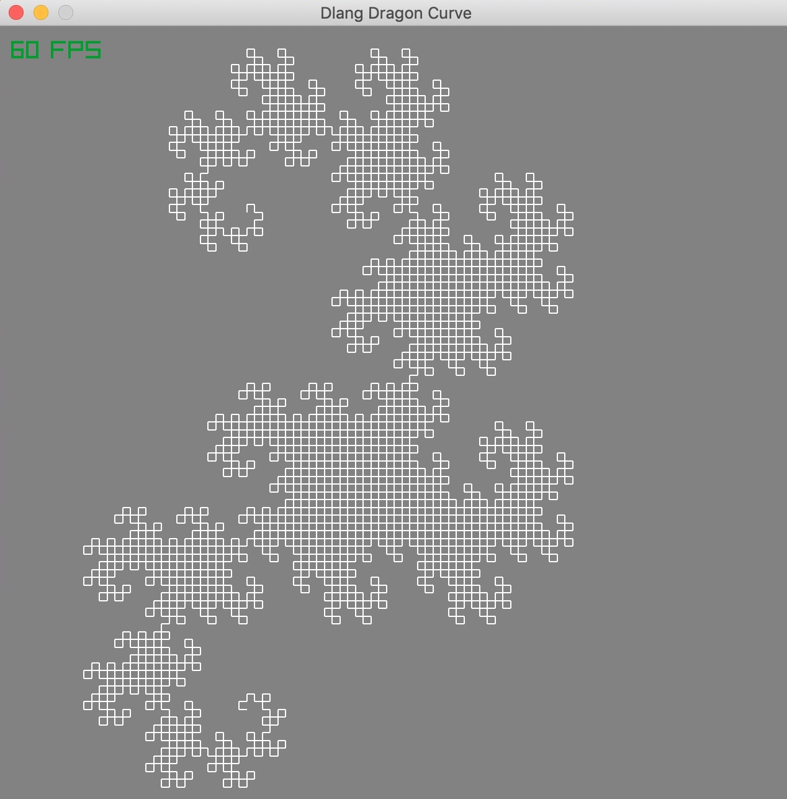
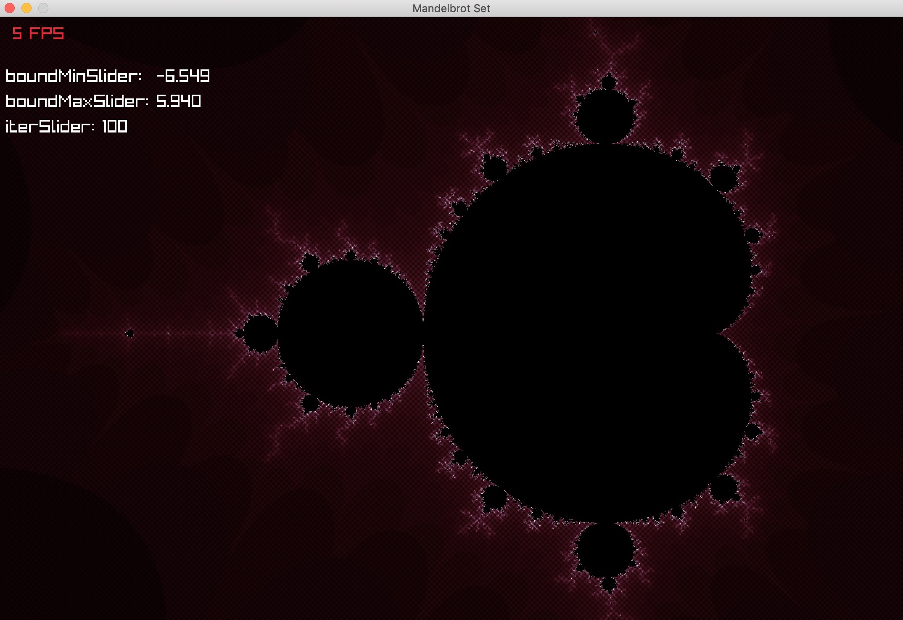

# Fractalia
Fractals Visualization

## Contents
### Sierpinski Triangle


### Koch Curve (snowflake)


* Dragon Curve (+ interactive mode [zoom in/out])


* Mandelbrot Fractal (+ interactive mode [zoom in/out])


## Dependencies
* [Raylib](https://www.raylib.com/)

## Requirements
To compile the code, you'll need two things:
1. [D compiler](https://dlang.org/download.html) (DMD/LDC is recommended)
2. [DUB](https://dub.pm/) package manager 

For Windows users: 

3. download `raylib` pre-compiled (binaries)[https://github.com/raysan5/raylib/releases] as well.
4. copy `raylib.dll` and `raylibdll.lib` into you project's folder (into the same directory as `dub.json`)

## How to compile
```
dub --build=release
```
Dub fetches the required packages, compiles and runs the executable.

If you have any questions or suggestions, or if you encounter any errors, create an issue or write me an email (rill.ki@yahoo.com).
