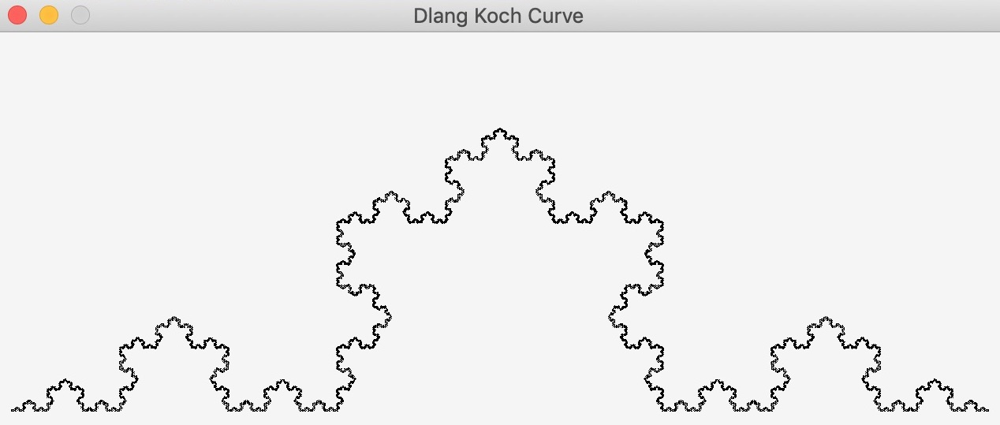

# Fractalia
Fractals Visualization

## Contents
### Sierpinski Triangle


### Koch Curve (snowflake)


* Dragon Curve (+ interactive mode [zoom in/out])


* Mandelbrot Fractal (+ interactive mode [zoom in/out])


### How to compile
To compile the code, you'll need two things:
1. [D compiler](https://dlang.org/download.html) (DMD/LDC is recommended)
2. [DUB](https://dub.pm/) package manager 

Then
```
git clone https://github.com/rillki/fractalia.git
cd 'fractalia/dragon curve' (choose a folder)
dub
```
Dub fetches the required packages, compiles and runs the executable.

If you have any questions or suggestions, or if you encounter any errors, create an issue or write me an email (rill.ki@yahoo.com).
